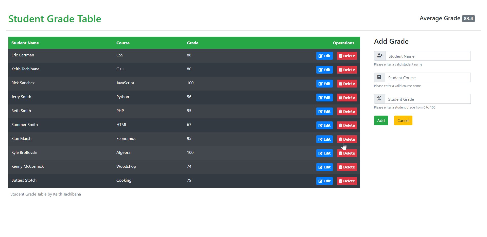

# Student Grade Table
A simple CRUD (Create, Read, Update, Delete), full-stack web application to create, read, update, and delete student grades
## Technologies Used
- -React.js 16.13.0
- -ReactDOM 16.13.0
- -Webpack 4.42.0
- -Bootstrap 4.4.1
- -FontAwesome 5.11.2
- -Node.js 10.15.3
- -CORS 2.8.5
- -Express 4.17.1
- -pg 7.18.2
- -@Babel/core 7.8.7
- -@Babel/plugin-transform-react-jsx 7.8.3
- -Babel-Loader 8.0.6
- -pm2 4.2.3
- -PostgreSQL 10.10
- -nginx 1.14.0
## Live Demo
Try the application live on [my porftolio website](https://www.keith-tachibana.com/portfolio/studentGradeTable/index.html)
## Features
- -Teachers can view a list of recorded grades
- -Teachers can view the average grade for the class
- -Teachers can add a grade to the table
- -Teachers can delete a grade from the table
- -Teachers can edit the student name, course name, or student grade from the table
## Preview

## Development
#### System Requirements
- -Node.js 10 or higher
- -NPM 6 or higher
- -PostgreSQL 10 or higher
- -nginx 1.10 or higher
- -pm2 4 or higher
#### Getting Started
1. Clone the repoistory
  ```shell
  git clone https://github.com/Keith-Tachibana/Student_Grade_Table_Fullstack.git
  ```
2. Change directory to cloned folder
  ```shell
  cd Student_Grade_Table_Fullstack/
  ```
3. Install all dependencies with NPM
  ```shell
  npm install
  ```
4. Start PostgreSQL server
  ```shell
  sudo service postgresql start
  ```
5. Create the database
  ```shell
  createdb studentGradeTable
  ```
6. Import the schema
  ```shell
  psql -d studentGradeTable -f schema.sql
  ```
7. Import the example data
  ```shell
  psql -d studentGradeTable -f data.sql
  ```
8. Edit your nginx default site configuration to reverse proxy the Express.js server
  ```shell
  cd /etc/nginx/sites-available
  sudo nano default
  ```
   - In the "server" code block, add this underneath the first location definition:
  ```shell
  location /api {
    proxy_pass http://127.0.0.1:3000;
  }
  ```
   - Save your changes (`Ctrl + O`) and exit (`Ctrl + X`)
  
9. Start nginx
  ```shell
  sudo service nginx start
  ```
10. Transpile React components using Webpack
  ```shell
  npm run build
  ```
11. Change directory to the server folder
  ```shell
  cd server/
  ```
12. Start the Express.js server using the pm2 module
  ```shell
  sudo pm2 start index.js
  ```
13. Open your default web browser and navigate to http://localhost:3000/ to see the result!
